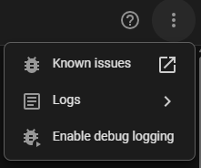

[](https://github.com/hacs/integration)
[](https://www.home-assistant.io/)
[](https://github.com/Asmir1975/homeconnect_local_hass-UI/releases)

[](https://github.com/Asmir1975/homeconnect_local_hass-UI/stargazers)
[](https://github.com/Asmir1975/homeconnect_local_hass-UI/releases)

<div align="center">

Control Bosch, Siemens and Neff appliances from Home Assistant over your local network.<br>
After setup, no cloud is involved.

⭐ If this fork helps you, a star makes it easier for others to find.

</div>

<sub>Independently developed, forked from [chris-mc1/homeconnect_local_hass](https://github.com/chris-mc1/homeconnect_local_hass).</sub>


## 💡 Why this fork

- 📥 Sign in to Home Connect during setup. You don't need the desktop tool, and it works on any device.
- 🔌 Local after setup: your appliances talk to Home Assistant directly.
- 🛠️ Actively maintained, with regular bug fixes and new features.

## 📋 Supported devices

| Device | Status | Device | Status |
|---|---|---|---|
| 🍽️ Dishwasher | ✅ Supported | 🧺 Washing machine | ✅ Supported |
| 🔥 Hob | ✅ Supported | 🧊 Fridge / Freezer | ✅ Supported |
| ♨️ Oven | ✅ Supported | ☕ Coffee machine | 🧪 In testing |
| 💨 Hood | ✅ Supported | 👕 Dryer | 🧪 In testing |

> [!NOTE]
> Two washing machines, hoods or ovens can behave quite differently. If yours doesn't work as expected, open an issue with a debug log and your model number. That's the only way we can track it down.

## 🚀 Get started

1. Add the repository to HACS, download it and restart Home Assistant.

   [](https://my.home-assistant.io/redirect/hacs_repository/?owner=Asmir1975&repository=homeconnect_local_hass-UI&category=integration)

   <sub>Or add it by hand: HACS → Custom repositories → `https://github.com/Asmir1975/homeconnect_local_hass-UI`, type Integration.</sub>

2. Add the integration and choose **Sign in with Home Connect**.

   [](https://my.home-assistant.io/redirect/config_flow_start/?domain=homeconnect_ws)

   <sub>Or upload a profile ZIP from the [profile downloader](https://github.com/bruestel/homeconnect-profile-downloader).</sub>

   <sub>If Home Assistant already found your appliance, click **Add** on it under Settings → Devices & Services instead.</sub>

3. Approve access, copy the full URL from your browser's address bar into the form, then pick your appliance. The page after approval won't load. That's normal. [Guide with screenshots](https://github.com/Asmir1975/homeconnect_local_hass-UI/discussions/102)

   <sub>You log in on the Home Connect page. Home Assistant only keeps the appliance profile.</sub>

4. If your appliance isn't found, enter its IP address. Your router lists it.

## 🐛 Issues & feature requests

[Open an issue](https://github.com/Asmir1975/homeconnect_local_hass-UI/issues) and attach:

- a **debug log** (see below)
- the **diagnostics** of the appliance: Settings → Devices & Services → Home Connect Local → your appliance → **Download diagnostics**. The file contains the appliance profile and current values. Keys, serial number and MAC address are removed.

  
- your **model number**

## 🪵 Debug logging

**In the UI**: Settings → Devices & Services → Home Connect Local → ⋮ → **Enable debug logging**. Reproduce the problem and disable it again. The log downloads automatically.



To include startup, add this to `configuration.yaml`, restart Home Assistant and download the full log:

```yaml
logger:
  logs:
    custom_components.homeconnect_ws: debug
    homeconnect_websocket: debug
```

[](https://my.home-assistant.io/redirect/logs/)

## 🙏 Credits

- [chris-mc1](https://github.com/chris-mc1) for [Home Connect Local](https://github.com/chris-mc1/homeconnect_local_hass) and the [homeconnect-websocket](https://github.com/chris-mc1/homeconnect_websocket) library.
- [bruestel](https://github.com/bruestel) for the [profile downloader](https://github.com/bruestel/homeconnect-profile-downloader). Our sign-in uses the same flow.
- [SamJongenelen](https://github.com/SamJongenelen) for the idea of downloading the profile during setup.
